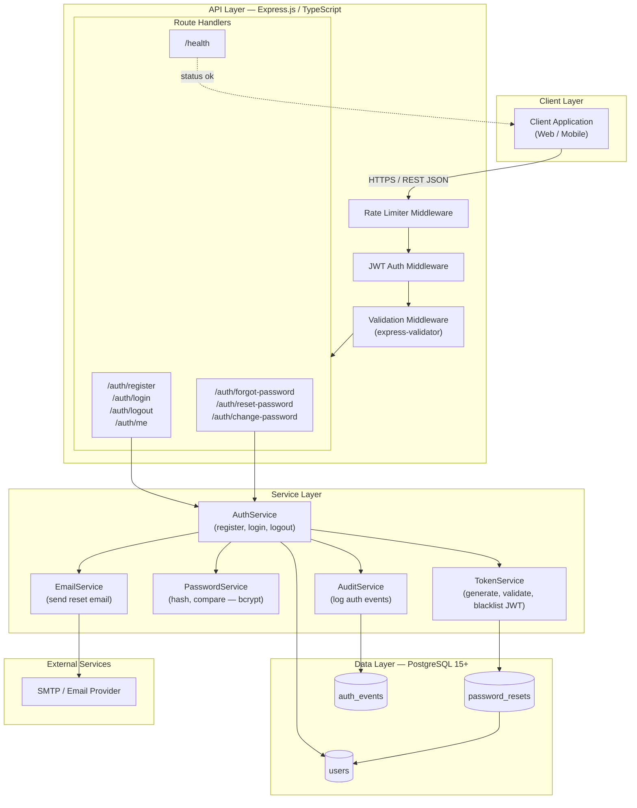
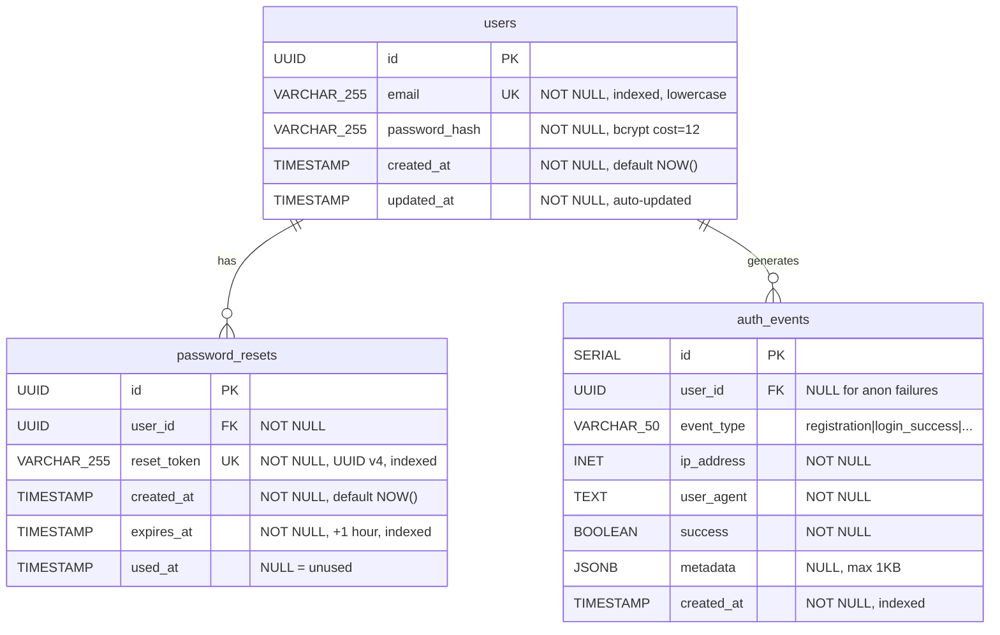
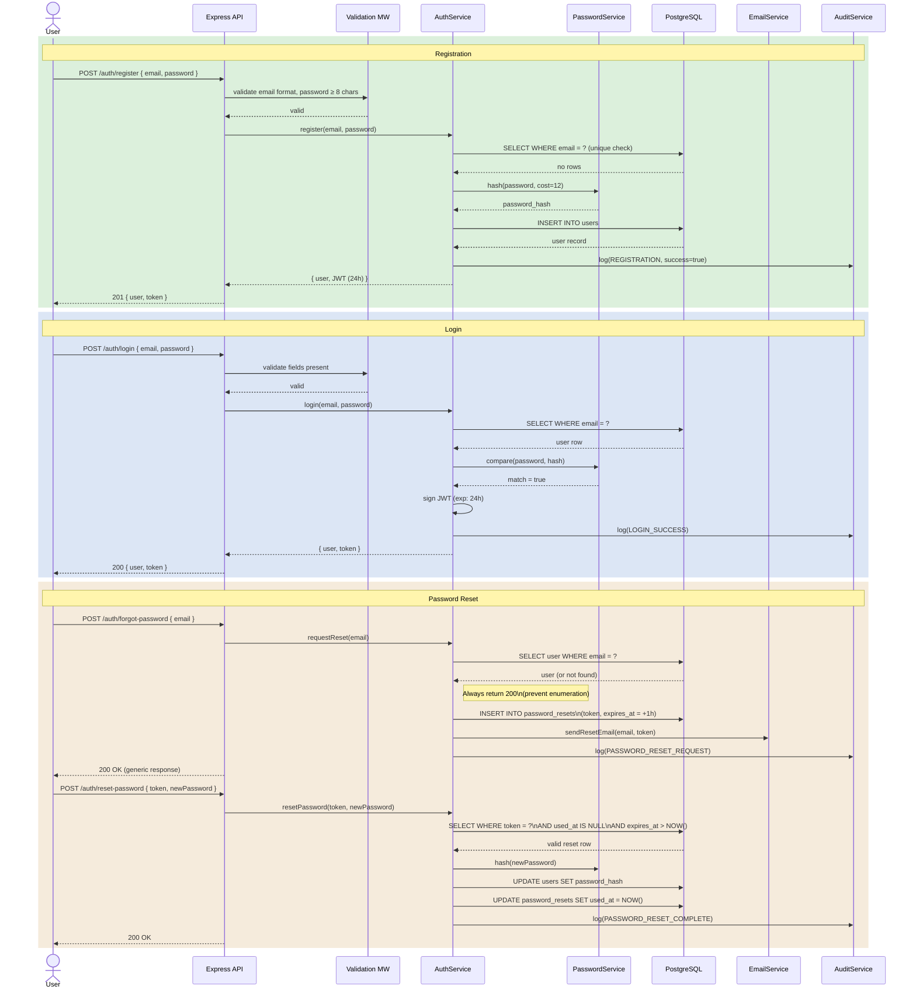

# Architecture & Component Diagrams: User Authentication System

**Feature**: 001-user-auth | **Date**: 2026-02-20

---

## 1. System Architecture

---

## 2. Data Model (ERD)

---

## 3. Auth Flows — Registration, Login, Password Reset

